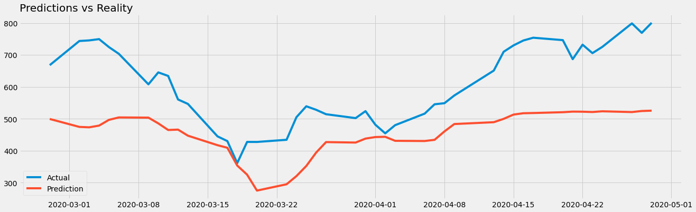

# Stock Prediction using Web Scraping and RNNs

This project deals with web scraping Tesla stock prices from the Yahoo Finance page, using Beautiful Soup and Selenium, and using Recurrent Neural Networks (particularly LSTMs) to build a Deep Learning model to predict future stock prices.

## Motivation

Stock Prediction is a versatile and extensive field on its own. With increasingly sophisticated computational capabilities, Stock Prediction is becoming a more and more important application of fields like Machine Learning, Deep Learning and AI. Getting into this extremely niche field is becoming more and more accessible, and such predictions can even be extrapolated to predict weather trends or other data that is in the time-series format.

## Technologies Used

This project primarily uses Beautiful Soup 4.9.0, Selenium 3.141.0, Numpy 1.18.3, Tensorflow 2.1.0 and Keras 2.3.0. The same code might not work with Tensorflow 1.x.x.

## Environment Used

The "TeslaStockPredictor" file was executed in the Google Colab environment, with a GPU configuration. Each epoch during training took around 3 seconds, which may differ everytime. The webscraper was executed in VSCode.

## Architecture Used

The Keras model built contains 1 Convolutional layer, 2 LSTMs (256 and 128 nodes) and 3 Dense Layers (128, 64 and 1 nodes).

## Result

The metrics used for measurement are Mean Absolute Error and Root Mean Squared Error. The MAE is 152.27446 and RMSE is 171.10997.

The plot for predictions of the model vs the actual values:

## Contribute

Contributions are open from everyone.
